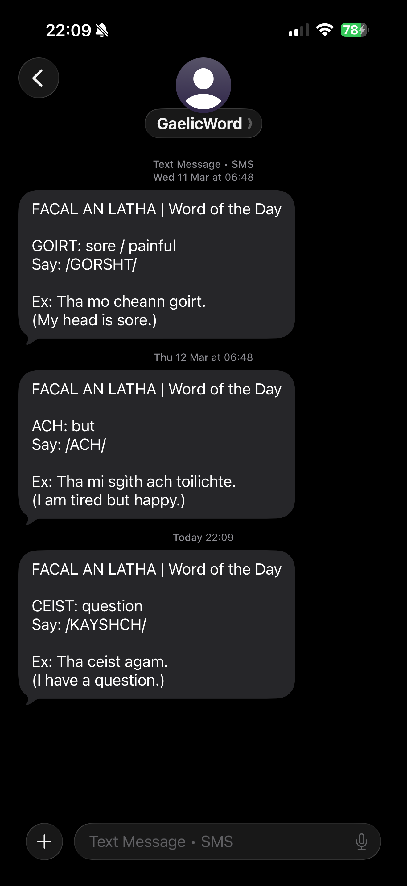

# Facal an Latha — Daily Scots Gaelic Word (SMS)

*Facal an latha* literally means “word of the day” in scottish gaelic.

Inspired by [Hammy Sgìth’s @aramachadan](https://www.tiktok.com/@aramachadan) series on TikTok.

A simple Python script that sends a daily SMS to me and my girlfriend.

Each message includes:

* The Gaelic word
* English meaning
* Phonetic pronunciation
* Example sentence both in Gaelic & English

  

## Why I made this

After seeing a couple of Hammy Sgìth’s videos, there was just something about the way he pronounces *facal an latha* that really stuck with me. I’d later remember the video, which meant I remembered the word and could actually use it when speaking to my girlfriend.

I’ve also been picking up bits of Gaelic from her over the years, so I thought it’d be a cool idea to have a daily word sent to both of us. It also gives us both a bit of a conversation starter later that day.

## How it works

* A GitHub Actions runs every morning
* It picks a word from `words.json`
* Sends it via SMS using ClickSend

## Notes

I did use Claude API to generate the `words.json` file.

---
